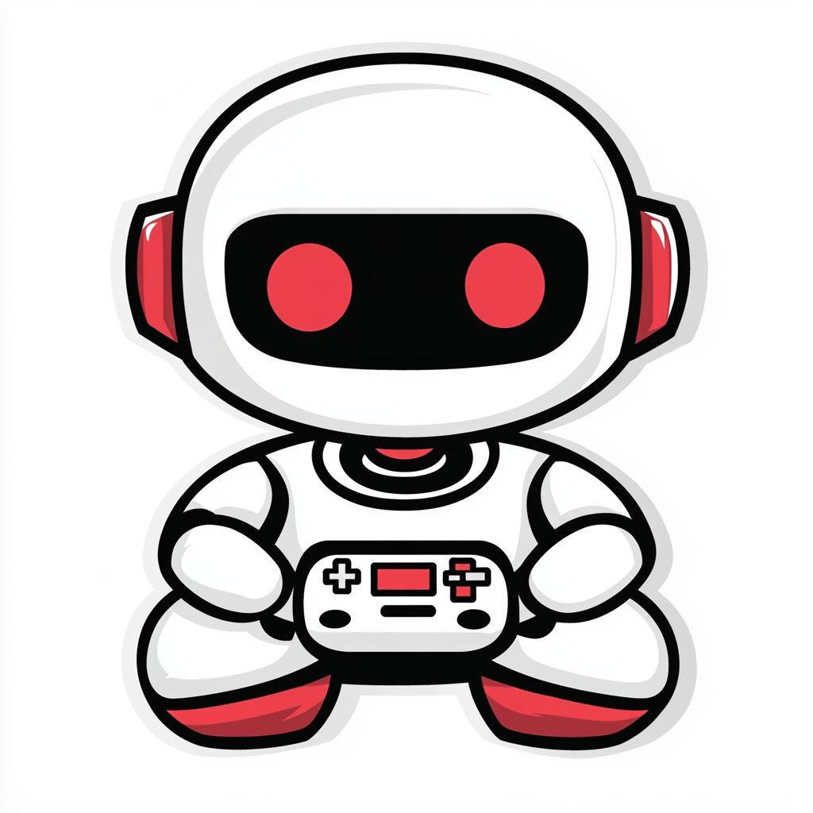
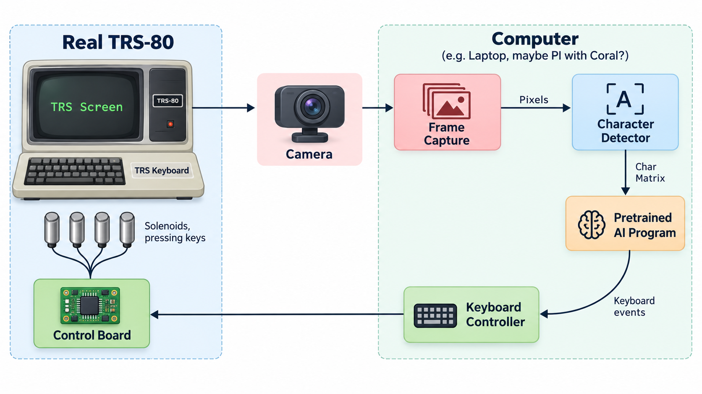

  

<h1 align="center">TRS-Bot</h1>

  <em>A physical robot that plays real games on a real, unmodified TRS-80.</em>

---

TRS-Bot is a robot that plays games on a **real** TRS-80. A camera is its eyes,
a neural network is its brain, and a row of solenoids are its fingers, pressing
the actual keys on the actual keyboard. No emulator, no modifications to the
machine, no cheating.

The target: a jaw-dropping demo at **Tandy Assembly 2027**.

## Goals

Straight from the original plan, with the year updated:

- 🤯 Have a jaw-dropping, kick-ass demo to show at Tandy Assembly 2027
- 🎓 Learn more about how to train and run an AI model for playing games
- 🍻 Have fun and spend quality time with each other

## How it works

The architecture:

  

1. **Camera**: points at the screen of a real TRS-80.
2. **Frame capture**: grabs frames from the camera as pixels.
3. **Character detector**: turns those pixels back into the TRS-80's character
   matrix, the same representation the model sees when trained on the emulator.
4. **Pretrained AI program**: the neural network, trained in the software
   emulator, picks the next action.
5. **Keyboard controller**: translates that action into keyboard events.
6. **Control board and solenoids**: solenoids mounted over the keys physically
   press them.

All of the software runs on a separate computer next to the TRS-80, such as a
laptop.

### Known challenges

- **No sync with the game.** We have no way to synchronize with the program
  running on the TRS-80, so the model has to be robust when a key press doesn't
  land at the precise moment.
- **Solenoid housing.** We'll 3D print a housing that holds the solenoids over
  the keys we need. Supporting more than one game means covering every key any
  of them uses.
- **Pixels or characters?** Instead of detecting characters, we could feed the
  camera image to the model directly. Training on the screen's memory region is
  easier, but it makes a reliable character detector necessary. That detector
  could be hand-optimized per game, since we know in advance which characters a
  game uses.
- **Glare.** The camera has to be positioned so that lights reflecting off the
  screen don't end up in the picture.

## The story

### 2013: The paper

DeepMind publishes
[*Playing Atari with Deep Reinforcement Learning*](https://arxiv.org/abs/1312.5602),
showing that a single neural network can learn to play Atari games from nothing
but the pixels on the screen and the score.

### 2017: trs-dqn

Arno Puder creates [trs-dqn](https://github.com/apuder/trs-dqn), an attempt to
recreate that work on a TRS-80 emulator instead of an Atari. Many years of work
go into trying to make the model converge, but progress is slow.

### 2023: The idea

I have a thought: if that model is ever successful, we could build a robot, a
physical one, that plays a real game on a real machine. How cool would that be?

### 2024: The plan

I write down a project plan and share it with my co-conspirators, Lawrence Kesteloot and
Arno Puder: [*TRS-AI: A game-playing robot*](https://docs.google.com/document/d/1ZZ-qDxlGa7vthX1Go8zEbySD5BxhOppnMQ5m7deZFhU/edit?usp=sharing).
The goal is a kick-ass demo for Tandy Assembly 2025, and the plan lays out in
detail how the whole system would work.

There is one prerequisite, though. If we want any chance of training a physical
robot to play a game, we first have to be able to train a model on the software
emulator.

### 2025: The plan falls through

Progress stays slow and we can't get the model to converge. No model, no robot.
Tandy Assembly 2025 comes and goes without one.

### 2026: The breakthrough

AI coding agents become really good, and with their help I get the project to a
point where it plays several games really well on the TRS-80 software emulator.
In late summer 2026 it beats Pete Cetinsky's *Breakdown*.

By then it is too late to build anything for Tandy Assembly that same year, and
we already have other projects underway. But at Tandy Assembly 2026, knowing
that training such a network is feasible, the plan to build the robot for the
following year takes shape.

### 2027: The robot

And so here we are. This is that project.

## References

- Mnih et al., [*Playing Atari with Deep Reinforcement Learning*](https://arxiv.org/abs/1312.5602) (DeepMind, 2013)
- Arno Puder's [trs-dqn](https://github.com/apuder/trs-dqn), where it all started
- The original project plan: [*TRS-AI: A game-playing robot*](https://docs.google.com/document/d/1ZZ-qDxlGa7vthX1Go8zEbySD5BxhOppnMQ5m7deZFhU/edit?usp=sharing)
- [Explained simply: How DeepMind taught AI to play video games](https://www.freecodecamp.org/news/explained-simply-how-deepmind-taught-ai-to-play-video-games-9eb5f38c89ee/)
- [Keras example: Deep Q-Learning for Atari Breakout](https://keras.io/examples/rl/deep_q_network_breakout/)
- [How to teach an AI to play games: Deep reinforcement learning](https://towardsdatascience.com/how-to-teach-an-ai-to-play-games-deep-reinforcement-learning-28f9b920440a)

## License

See [LICENSE](LICENSE).
